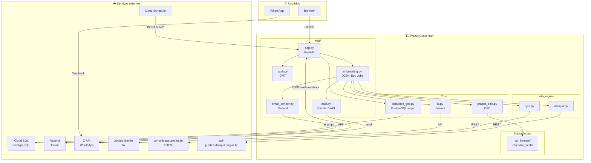

# Prazu — Mapa Mental da Arquitetura

## Diagrama de componentes (Mermaid)



---

## Mapa mental por camadas

```
Prazu
│
├── 🌐 ENTRADA
│   ├── Browser → prazu.com.br (HTTPS)
│   │   ├── /cadastro, /login, /esqueci-senha
│   │   ├── /onboarding
│   │   ├── /dashboard
│   │   ├── /configuracoes
│   │   └── /termos, /privacidade
│   │
│   ├── Webhook Z-API → /webhook/zapi
│   │   └── Mensagens WhatsApp recebidas
│   │
│   └── Cloud Scheduler → /jobs/*
│       ├── /jobs/briefing (briefing diário)
│       ├── /jobs/expirar-trials
│       ├── /jobs/djen
│       └── /jobs/lembrete-trial
│
├── 🔐 AUTENTICAÇÃO
│   ├── JWT (cookie prazu_token)
│   ├── Sessions (tabela sessions)
│   └── Dependência: advogado_logado
│
├── 💼 LÓGICA DE NEGÓCIO
│   ├── Cadastro / Login / Recuperação senha
│   ├── Onboarding (OAB, WhatsApp, preferências)
│   ├── Busca DJEN → DataJud → processos + prazos
│   ├── Cálculo de prazos (prazos_calc + cal_forense)
│   ├── Briefing (IA Gemini)
│   └── Bot WhatsApp (comandos + IA)
│
├── 🗄️ PERSISTÊNCIA
│   ├── PostgreSQL (Cloud SQL)
│   │   ├── advogados
│   │   ├── processos
│   │   ├── prazos
│   │   ├── comunicacoes_djen
│   │   └── whatsapp_events
│   └── SQLite (calendar_v2.db) — feriados forenses
│
└── 🔌 INTEGRAÇÕES
    ├── Resend → emails (códigos, recuperação senha)
    ├── Z-API → envio/recebimento WhatsApp
    ├── Gemini → briefings, respostas IA
    ├── DJEN API → publicações por OAB
    └── DataJud API → detalhes de processos (CNJ)
```

---

## Fluxo de dados simplificado

```
┌─────────────┐     ┌──────────────┐     ┌─────────────┐
│   Usuário   │────▶│  Cloud Run   │────▶│ Cloud SQL   │
│ (Web/WPP)   │     │  (FastAPI)   │     │ (PostgreSQL)│
└─────────────┘     └──────┬───────┘     └─────────────┘
                          │
          ┌───────────────┼───────────────┐
          ▼               ▼               ▼
   ┌────────────┐  ┌────────────┐  ┌────────────┐
   │ Resend     │  │ Z-API      │  │ Gemini     │
   │ (email)    │  │ (WhatsApp) │  │ (IA)       │
   └────────────┘  └────────────┘  └────────────┘
          │               │               │
          └───────────────┼───────────────┘
                          ▼
                  ┌───────────────┐
                  │ DJEN + DataJud│
                  │ (processos)   │
                  └───────────────┘
```

---

## Variáveis de ambiente por serviço

| Serviço | Variáveis principais |
|---------|----------------------|
| **App** | ENVIRONMENT, JWT_SECRET |
| **Banco** | DB_HOST, DB_NAME, DB_USER, DB_PASSWORD, CLOUD_SQL_INSTANCE |
| **Z-API** | ZAPI_INSTANCE_ID, ZAPI_TOKEN, ZAPI_CLIENT_TOKEN, ZAPI_WEBHOOK_SECRET |
| **Resend** | RESEND_API_KEY, EMAIL_FROM |
| **Gemini** | GEMINI_API_KEY |
| **Jobs** | SCHEDULER_SECRET |
